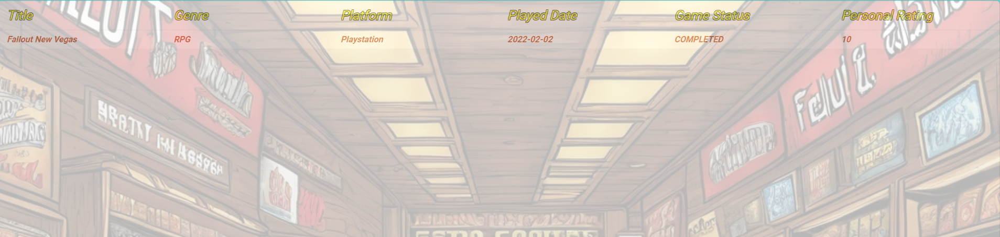

# GameVault

Welcome to the Mojave Wasteland traveller!
Enjoy this trip while you are visiting your videogames museum or start a conversation with an AI-powered chat.


## Table of Contents

- [Installation](#installation)
- [Usage](#usage)
- [Contributing](#contributing)
- [License](#license)

## Installation

Create a db.properties file in which you specify your connection url database and the access credentials.
Use your Mistral API key, it's free :P .

## Usage

-Save Videogame Button -> to save a new game into the dashboard


-Chat with Victor -> start a new conversation with Victor NPC! 


-My Videogames -> Watch your videogames museum


## Dependencies

**Spring Boot:** Framework for the back-end application.

**Vaadin** Framework for the front-end application.

**Spring Security:** For securing the application endpoints.

**Spring Data JPA:** For data persistence and interaction with the Postgres database.

**Postgres Database:** Relational database for storing character data.

**Lombok:** Library to reduce boilerplate code by generating getters, setters, and constructors.

**Mistral AI** Mistral AI is an artificial intelligence library that provides various AI functionalities. It is used in this project for the implementation of an AI-powered chat bot.

`N.B:` in order to use Mistral AI in your project, you need to add the base-url in combo with the API key which are not provided in this repo.


**Jakarta Persistence API (JPA):** For ORM mapping and database interaction.


## Setup and Running the Application

### Prerequisites
- Java 11 or higher
- Maven
- Mistral AI API
- Database connection

### Steps
1. **Clone the repository:**
   ```bash
   git clone <repository-url>
   cd GameVault

2. ***Build the project:***
   ```bash
   mvn clean install
3. **Run the application:**
   ```bash
   mvn spring-boot:run


## Contributing

Feel free to contribute on this project.